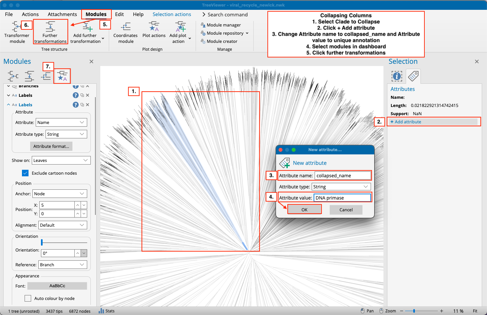
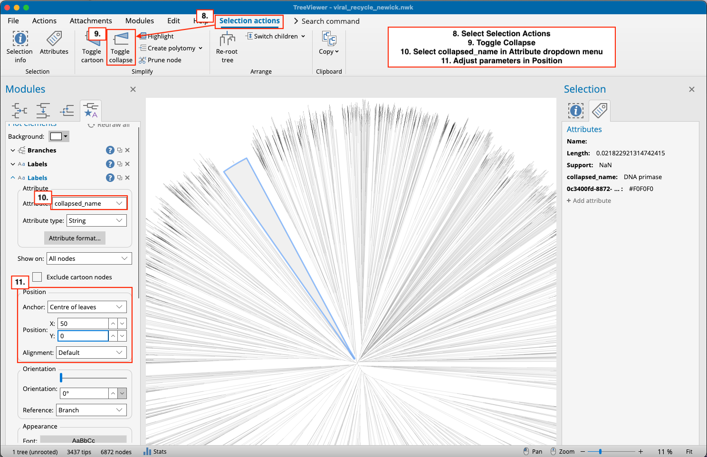

# viral\_carbon\_cycling\_proteins

This repository contains an analysis pipeline for identifying viral proteins potentially involved in carbon recycling. We work from predicted protein sequences to construct a protein similarity dendrogram (i.e., a protein tree), allowing us to cluster sequences and infer protein function for phenotypic characterization of viral genotypes.

---

## Page Overview

Currently, this page provides the process to generate a protein similarity tree in TreeViewer and collapse clades in that tree. 

---

## Workflow

### 1. Input Protein Sequences

Predicted protein sequences were provided in FASTA format:

```plaintext
>Sequence_ID_1
PROTEIN_SEQUENCE_1
>Sequence_ID_2
PROTEIN_SEQUENCE_2
>Sequence_ID_3
PROTEIN_SEQUENCE_3
...
```

---

### 2. Sequence Clustering

* Sequences were clustered at **75% sequence similarity**.
* Only clusters with **≥10 sequences** were retained.
* Final dataset: **3,457 protein sequences**.

```bash
# We used MMseqs2 to cluster sequences at 75% sequence similarity 

## Step 1: Install MMseqs2
brew install mmseqs2

## Step 2: Convert FASTA to MMseqs2 database
mmseqs createdb our_sequence_file.fa seqDB

## Step 3: Cluster sequences at 75% identity and 80% coverage (shorter sequence)
mmseqs linclust \
  seqDB \
  clusterDB \
  tmp \
  --min-seq-id 0.75 \
  -c 0.8 \
  --cov-mode 1
  
## Step 4:  Export cluster assignments in TSV format
mmseqs createtsv seqDB seqDB clusterDB clusters.tsv

## Step 5: Filter clusters to retain only those with ≥10 members
awk '{count[$1]++; lines[NR]=$0; cluster[NR]=$1} END {for (i=1; i<=NR; i++) if (count[cluster[i]] >= 10) print lines[i]}' clusters.tsv > clusters_filtered.tsv

```


---

### 3. Pairwise Sequence Comparison

All-versus-all pairwise comparisons were conducted across the filtered sequences:

```plaintext
PROTEIN_SEQUENCE_1 → PROTEIN_SEQUENCE_2  
PROTEIN_SEQUENCE_1 → PROTEIN_SEQUENCE_3  
PROTEIN_SEQUENCE_2 → PROTEIN_SEQUENCE_3  
...
🔗 GitHub Repository: protein_embed_softalign

Total comparisons: 5,973,696

---

### 4. Alignment Score Output

Pairwise comparison results were saved in a tab-separated file:

**File:** `tree_files/viral_recycling_sa_scores_total.tsv.zip`

| Sequence-ID1 | Sequence-ID2 | Matches | Length1 | Length2 |
| ------------ | ------------ | ------- | ------- | ------- |
| PROTEIN\_1   | PROTEIN\_2   | 15      | 100     | 150     |
| PROTEIN\_1   | PROTEIN\_3   | 75      | 100     | 200     |
| PROTEIN\_2   | PROTEIN\_3   | 10      | 150     | 200     |

---

### 5. Convert to Distance Matrix

A distance matrix was generated by converting similarity scores to distance and generating a lower-triangular distance matrix:

```python
dist = 1 - (alignment_score / min(length1, length2))
```

Output: [`tree_files/viral_recycle_dm.phylip`](tree_files/viral_recycle_dm.phylip)

<details>
<summary>View Python Code</summary>

```python
import pandas as pd
import numpy as np

df = pd.read_csv("viral_recycling_sa_scores_total.tsv", sep="\t", header=None,
                 names=["seq_1", "seq_2", "alignment", "seq_1_len", "seq_2_len"])

seqs = sorted(set(df["seq_1"]).union(df["seq_2"]))
dist_matrix = pd.DataFrame(np.nan, index=seqs, columns=seqs)

for _, row in df.iterrows():
    s1, s2 = row["seq_1"], row["seq_2"]
    aln = row["alignment"]
    l1, l2 = row["seq_1_len"], row["seq_2_len"]
    dist = 1 - (aln / min(l1, l2))
    if s1 != s2:
        if seqs.index(s1) > seqs.index(s2):
            dist_matrix.loc[s1, s2] = dist
        else:
            dist_matrix.loc[s2, s1] = dist

for s in seqs:
    dist_matrix.loc[s, s] = 0.0

with open('./viral_recycle_dm.phylip', 'w') as f:
    f.write(f"{len(seqs)}\n")
    for i, label in enumerate(seqs):
        values = " ".join(f"{dist_matrix.iloc[i, j]:.5f}" for j in range(i + 1))
        f.write(f"{label} {values}\n")
```

</details>

---

### 6. Visualize Protein Tree

The `.phylip` file was loaded into [**TreeViewer**](https://github.com/arklumpus/TreeViewer) for dendrogram construction.

To open the distance matrix as a tree go to File -> New -> Click Neighbor-Joining, Distance Matrix -> Load from file:


---

### 7. Export Tree in Newick Format

To save the tree:

> Navigate to **File → Save Loaded Tree → Newick format**

The resulting `.nwk` file can be used for further visualization or integration with phylogenetic tools (e.g., Iroki, ITOL). Tree should be in circular format.


---

### 8. Collapse Clades in Tree

To collapsing clades.



---

## GitHub Repository Structure

```
viral_carbon_cycling_proteins/
├── tree_files/
│   ├── viral_recycling_sa_scores_total.tsv.zip
│   ├── viral_recycle_dm.phylip
├── tree_viewer_make_tree.png
├── viral_recycle_make_dm.ipynb
└── README.md
```

---
